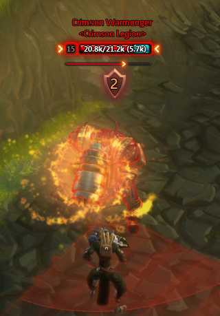
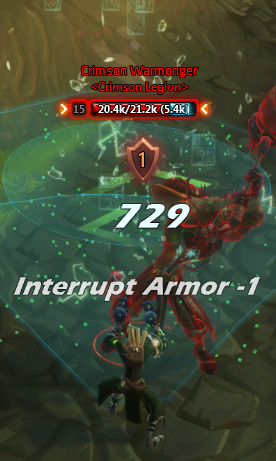

# InterruptMe

A minimalistic interrupt counter which only appears when needed.

## "which only appears when needed" when exactly?

- The enemies interrupt shield is lower than his maximum, which indicates that someone from your group used an interrupt
- The enemy casts something which is interruptable

## Screenshots

## License

MIT
